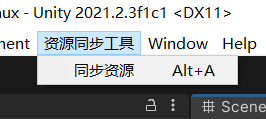
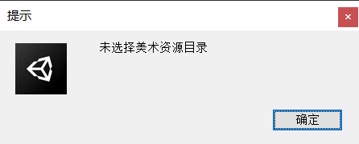
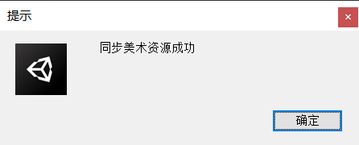
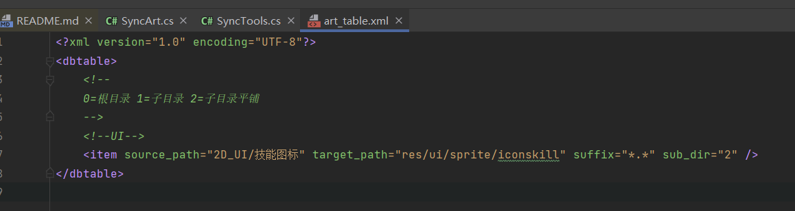
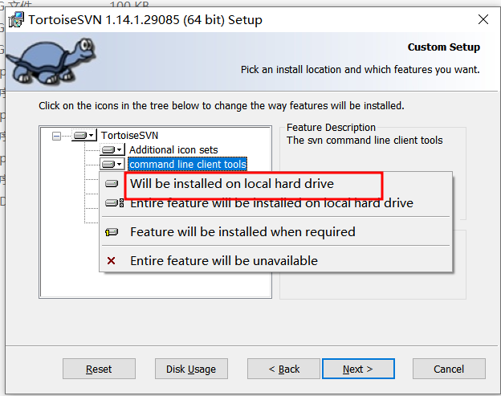

# 美术资源自动拷贝工具
概述
---
由于现在开发流程的特殊性，美术资源是美术单独提交到SVN，每次程序都需要手动把目标资源拷贝到git的Unity工程。手动操作容易出错，并且浪费时间。我们需要一个自动拷贝的工具，为了方便使用我们直接把工具集成到Unity。  
美术做的资源也可以提交前先用命令行导入到unity验证下实际的效果是否正确，不需要等程序同步完资源在验证，提高效率。

使用流程
------
**快捷键ALT+A**

首次使用需要指定美术目录
------------------
E:\project\github\SyncArt\Arts

成功提示
------

导出配置
------
Editor/ToolGen/Config/art_table.xml

字段说明
------
|地段|说明|
|--- | :---|
|source_path   | 美术资源相对目录  |
|target_path   | Unity工程相对目录  |
|suffix        | 目标后缀，支R持数组 ;分隔 |
|sub_dir       | 是否拷贝子目录 0=根目录 1=子目录 2=子目录平铺 |

SVN安装命令行
-----------
Windows
-------
检测命令行是否安装  
CMD运行 svn help  
1.需要重新安装  
2.不需要

重新安装
------

Mac
---
brew install svn